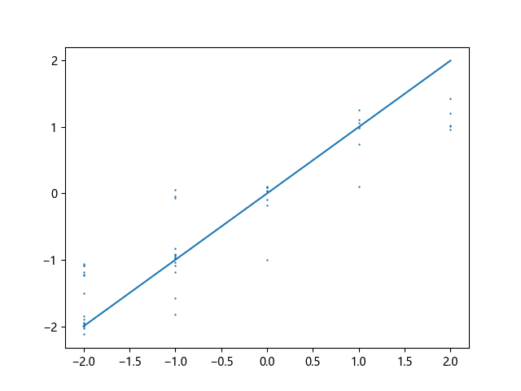

# Emotion Rate
基于Resnet-50的表情打分

## 项目简介

该项目基于Resnet-50，以KDEF数据集为基础，进行了人工分数标注，实现了对于表情的评分。

## 使用

### 1.训练模型

运行`train.py`开始训练模型，训练完成后模型会保存到`model`文件夹，如果不想训练，也可以从这里下载训练好的模型文件

[百度网盘](https://pan.baidu.com/s/119KCkhhmBv2sbvqEQSfbhA)

提取码: ym9b

### 2.验证模型

使用验证集验证模型，验证结果会显示在屏幕上。



其中横坐标为数据集的标注分数，纵坐标为模型给出的分数。

### 3.测试模型

运行`test.py`，模型会对`test_image`中的图片进行评分，并显示在屏幕上。

## 图片预处理

如果希望自己添加图片需要进行图片的预处理（人脸裁切），需要将需要处理的照片位于`image`，运行`image_process.py`后处理后的人脸图片位于`image_out`

### TensorFlow Lite部分

### 1.转换

如需将Keras模型转换为TensorFlow模型，运行`transfer_model.py`

### 2.测试

运行`run_tflite.py`可以测试转换完成的tflite模型。

## License

[GPLv3](https://github.com/Fewing/Emotion_Rate/blob/master/LICENSE )

## 参考项目

```
FaceRank                    https://github.com/fendouai/FaceRank
facial_beauty_prediction    https://github.com/jackhuntcn/facial_beauty_prediction
```

